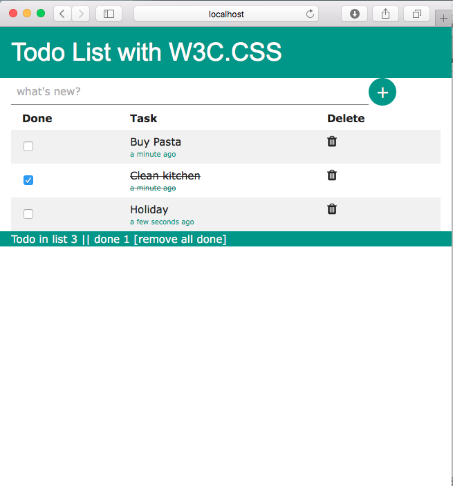

# Todo — another ToDo AngularJS app - W3C.css
This project is an ToDo AngularJS application, it uses the [W3C.css](http://www.w3schools.com/w3css/default.asp)

##Features
* Add task
* Set that task is done 
* Remove task
* Remove all done tasks


## Getting Started

To get you started you can simply clone this repo and install the dependencies:

### Usage 

```
git clone https://github.com/angular/angular-seed.git
cd angular-seed
npm install
npm start
```

Now browse to the app at `http://localhost:8000/index.html`.

###Screen


## What's used in the project
* moment.js / angular-moment.js 

```
<div class="w3-tiny w3-text-teal" am-time-ago="todo.created" ></div>
```
* how to create a $filter, it returns the number of done tasks

```
.filter('done', function() {
    return function(input ) {
    var output=0;
    angular.forEach(input, function (v,i) {
        if(v.checked)
            output++
    })
    return output;
}
});

```
* how to use the localstorage

```
(JSON.parse(localStorage.getItem('tasks')))!=null?$scope.todolist = JSON.parse(localStorage.getItem('tasks')):$scope.todolist =[];
...
localStorage.setItem('tasks', JSON.stringify($scope.todolist));

```

* ngAnimate

```
.fade.ng-enter {
  transition:2s linear all;
  opacity:0;
}

.fade.ng-enter.ng-enter-active {
  opacity:1;
}

<tr ng-repeat="todo in todolist" ng-class="{'line-through':todo.checked,'':!todo.checked}" class="fade">
    <td><input ng-click="updatecheck()" class="w3-check" type="checkbox" checked="{{todo.checked}}" ng-model="todo.checked">
    <td>
        <div class="w3-medium">{{todo.task}}</div>
        <div class="w3-tiny w3-text-teal" am-time-ago="todo.created" ></div>
</td>
    <td> <i class="fa fa-trash w3-large" ng-click="delete(todo)"></i> </td>
</tr>


```


